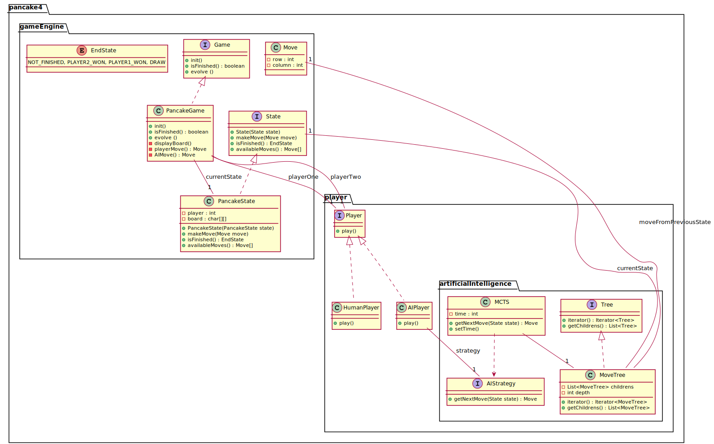

# Projet puissance 4 et MCTS


## Récupération, compilation et exécution du projet :
Pour faciliter le travail à distance et dans des environnements différents,
nous avons utilisé l'outil de compilation automatique maven.\
Ainsi, pour que ce projet fonctionne veuillez vous assurer que : 
- les variables d'environnement MAVEN_HOME et JAVA_HOME sont bien définies
  (et que les dossiers %MAVEN_HOME%\bin et %JAVA_HOME%\bin sont bien dans la variable d'environnement Path)
- l'environnement Java lié à JAVA_HOME est Java 11 ou plus.
- votre ordinateur est connecté à Internet.

Voici une liste de commande qui vous permettra de :
- télécharger les sources
- compiler l'application

```sh
git clone https://github.com/TabaryM/Pancake.git
cd Pancake
mvn javafx:jlink
```
Pour exécuter l'application :
- Si vous êtes sur un système Windows : 
  - `start.bat`
- Si vous êtes sur un système UNIX : 
  - `start.sh`

## TODOListe : 
- Création du jeu de puissance 4
  - Modèle back-end
    - Grille (graphe ?)
    - Représentation des jetons dans la grille
    - Représentation des joueurs (pour faciliter l'intégration de l'IA)
    - Reconnaissance fin de partie
  - Affichage front-end
- Création d'IA de jeu
  - jeu random
  - Monte-Carlo Tree-Search UCT (Upper Confidence bound in Trees)

## Diagramme de classe (mal rangé)
